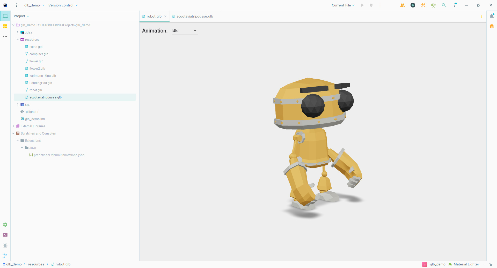

# GLB Viewer Plugin

The GLB Viewer Plugin for IntelliJ enables seamless GLB file viewing and animation support directly
within your IntelliJ IDE. With this plugin, you can effortlessly explore, interact with, and analyze 3D models.
It provides cross-platform compatibility and efficient communication through Flutter Web and Spring Boot,
enhancing your development workflow and empowering you to streamline your 3D development process.

## Installation

- Using IDE built-in plugin system:

  <kbd>Settings/Preferences</kbd> > <kbd>Plugins</kbd> > <kbd>Marketplace</kbd> > <kbd>Search for "glb-viewer"</kbd> >
  <kbd>Install Plugin</kbd>

- Manually:

  Download the [latest release](https://github.com/issaloubani/glb-viewer/releases/latest) and install it manually using
  <kbd>Settings/Preferences</kbd> > <kbd>Plugins</kbd> > <kbd>⚙️</kbd> > <kbd>Install plugin from disk...</kbd>

## Features

- View and analyze GLB files within IntelliJ IDE.
- Support for 3D model animation.
- Cross-platform compatibility.
- Efficient communication through Flutter Web and Spring Boot.

## Demo Video

## Screenshots

  
  
  

## Usage

Once the plugin is installed, you can use the GLB Viewer in the following way:

1. Open a project in IntelliJ IDEA.
2. Locate a GLB file in your project directory.
3. Right-click on the GLB file.
4. Select **Open with GLB Viewer** from the context menu.
5. The GLB Viewer will open, allowing you to explore and interact with the 3D model.
6. Use the provided controls to manipulate the model, view animations, and analyze the details.

## Support and Feedback

If you encounter any issues or have suggestions for improvement,
please [submit an issue](https://github.com/your-repo-url/issues) on the GitHub repository.

---

## License

This plugin is released under the [Apache License 2.0](https://www.apache.org/licenses/LICENSE-2.0).

Plugin based on the [IntelliJ Platform Plugin Template][template].

[template]: https://github.com/JetBrains/intellij-platform-plugin-template

[docs:plugin-description]: https://plugins.jetbrains.com/docs/intellij/plugin-user-experience.html#plugin-description-and-presentation